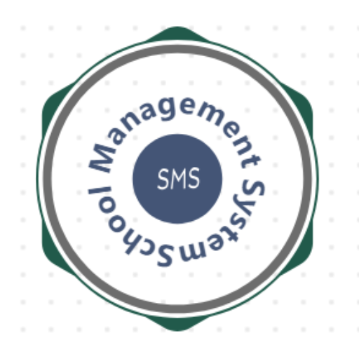
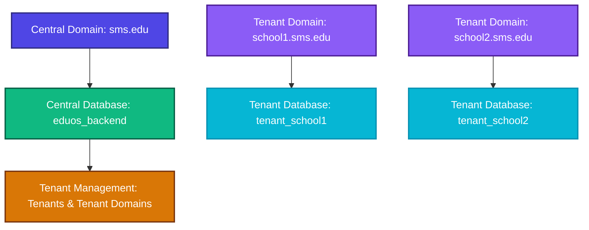

# 🏫 Eduos School Management System (Backend API & Core)

<p align="center">
  <a href="https://github.com/rayusamBoy/Laravel_tenancy_sms" target="_blank">
    
  </a>
</p>

<div align="center">

[](https://laravel.com)
[](https://php.net)
[](https://mysql.com)
[](https://opensource.org/licenses/MIT)

</div>

---

## 📖 About the Backend

This is the high-performance, multi-tenant backend engine for the **Eduos School Management System**, powered by **Laravel 12**, **PHP 8.2+**, and **Stancl Tenancy**. It implements a robust, database-separated multi-tenancy architecture designed to serve educational institutions (schools, colleges, academies) dynamically. 

The backend supports advanced system operations, event-driven web sockets, real-time message broadcasting via **Laravel Reverb**, Firebase Cloud Messaging (FCM) notifications, security configurations (Google 2FA), and multi-role operations.

---

## ⚙️ Core Architecture & Features



*   **Multi-Tenancy Engine (`Stancl Tenancy`)**: Automates database separation, schema separation, storage paths, and host redirection dynamically.
*   **WebSockets & Real-time Broadcasting**: Powered by **Laravel Reverb** (or Pusher) for system-wide alerts, push updates, and active messaging.
*   **Role-Based Access Control (RBAC)**: Comprehensive access gates serving 9 user roles (`IT Guy` at central scope; `Super Admin`, `Admin`, `Teacher`, `Student`, `Parent`, `Accountant`, `Librarian`, and `Companion` at tenant scopes).
*   **Background Jobs & Queue Pipelines**: Configured default database connection queues for heavy notifications, backups, and tasks.
*   **Integrated Log Monitoring**: Embedded developer dashboards for backend tracking, warning traces, and log auditing.

---

## 🛠️ Prerequisites

Before installing the backend, ensure your development environment satisfies the following requirements:

*   **PHP**: `^8.2` or higher
    *   Required Extensions: `openssl`, `pdo`, `mbstring`, `tokenizer`, `xml`, `ctype`, `json`, `bcmath`, `curl`, `gd`, `zip`
*   **Composer**: `^2.2` or higher
*   **Database Server**: MySQL `^8.0` / MariaDB `^10.4`
*   **Node.js & NPM**: `^18.x` or higher (necessary for compiling assets and scaffolding frontend builds)
*   **Local Web Server**: Apache (XAMPP), Nginx, Laravel Valet, or Laravel Sail

---

## 🚀 Step-by-Step Backend Installation

Follow these instructions to configure, migrate, and run the backend environment locally:

### 1. Clone the Repository
```bash
git clone https://github.com/rayusamBoy/Laravel_tenancy_sms.git
cd Laravel_tenancy_sms
```

### 2. Install PHP Dependencies
Install the required Laravel vendor libraries using Composer:
```bash
composer install
```

### 3. Install NPM Dependencies & Build Assets
While this is a backend-focused setup, you must install and compile the initial Javascript and assets configuration for Reverb connections, session management, and PWAs:
```bash
npm install
npm run build
```

### 4. Create Environment Configuration File
Copy the example file to initialize your environmental settings:
```bash
cp .env.example .env
```

### 5. Generate Application Encryption Key
Generate a secure application key:
```bash
php artisan key:generate
```

### 6. Create Public Storage Symlink
Link the backend storage disk to the public path so that uploaded documents, ID themes, and media are accessible:
```bash
php artisan storage:link
```

### 7. Database Initialization
1. Start your MySQL/MariaDB server.
2. Create an empty database for the **Central Scheme** (e.g. `eduos_backend` or as specified in your `.env` file).
3. Update your `.env` database parameters:
   ```env
   DB_CONNECTION=mysql
   DB_HOST=127.0.0.1
   DB_PORT=3306
   DB_DATABASE=eduos_backend
   DB_USERNAME=root
   DB_PASSWORD=your_secure_password
   ```

### 8. Run Central Migrations & Seeders
Migrate the central database schema and seed the primary `IT Guy` administrator account:
```bash
php artisan migrate
php artisan db:seed --class=DatabaseSeederNonTenancy
```

---

## 📝 Environment (.env) Variables Configuration

Configure these parameters in your `.env` file based on your operational requirements:

### A. Database Connections
*   `DB_DATABASE`: Central database name. Tenant databases are automatically created dynamically with names prefixed by `tenant` followed by the tenant ID.
*   `DB_USERNAME` & `DB_PASSWORD`: Standard credentials with database creation permissions.

### B. Broadcasting & Real-Time (Laravel Reverb)
Set the socket server parameters for web notifications:
```env
BROADCAST_CONNECTION=reverb

REVERB_APP_ID=277714
REVERB_APP_KEY=pdqefpozlqkhk0z0nn37
REVERB_APP_SECRET=rcodfi6r9aza2npo5ais
REVERB_HOST="localhost"
REVERB_PORT=8080
REVERB_SCHEME=http

VITE_REVERB_APP_KEY="${REVERB_APP_KEY}"
VITE_REVERB_HOST="${REVERB_HOST}"
VITE_REVERB_PORT="${REVERB_PORT}"
VITE_REVERB_SCHEME="${REVERB_SCHEME}"
```

### C. Push Notifications (FCM - Firebase Cloud Messaging)
*(Optional)* Add Firebase service account details and tokens for background notification triggers:
```env
FIREBASE_CREDENTIALS=storage/app/private/firebase/service-account-credentials.json
VITE_VAPID_KEY=your_vapid_public_key
```

### D. Mail Server Setup
Configure the mailer settings for account recovery and invitations:
```env
MAIL_MAILER=smtp
MAIL_HOST=mailpit
MAIL_PORT=1025
MAIL_USERNAME=null
MAIL_PASSWORD=null
MAIL_ENCRYPTION=null
MAIL_FROM_ADDRESS="no-reply@sms.edu"
MAIL_FROM_NAME="Eduos School System"
```

> [!WARNING]
> If you modify environment variables that are prefixed with `VITE_` or change the `BROADCAST_CONNECTION`, you must recompile front-end service bindings by running:
> ```bash
> npm run build
> ```

---

## 🏢 Multi-Tenancy Configuration & Setup

### Domain Names & Wildcard Routing
To run multiple school tenants, you must bind your domain to include wildcard matches or subdomains. 

1. **Central Domain Configuration**:
   Open `config/tenancy.php` and verify the central domains allowed by the application. Under local environments, this usually resolves to `localhost` or `127.0.0.1`:
   ```php
   'central_domains' => [
       '127.0.0.1',
       'localhost',
       'sms.edu', // Central domain
   ],
   ```

2. **Local Hosts Binding**:
   Add test mappings to your hosts configuration file (e.g. `C:\Windows\System32\drivers\etc\hosts` on Windows or `/etc/hosts` on Unix):
   ```text
   127.0.0.1   sms.edu
   127.0.0.1   school1.sms.edu
   127.0.0.1   school2.sms.edu
   ```

3. **Tenant Domain Creation**:
   Once you log into the central control dashboard at `http://sms.edu:8000` (using the `IT Guy` account), you can create tenants. The tenant database and its schemas are constructed automatically in the background.

---

## ⚡ Running the Services

Open separate console windows to run the required backend services:

### 1. Start the HTTP Application Server
```bash
php artisan serve
```
*(By default, this hosts the application at `http://localhost:8000` or `http://127.0.0.1:8000`)*

### 2. Start the WebSocket Server (Laravel Reverb)
To handle notifications, live messaging threads, and support tickets in real-time, execute the Reverb demon:
```bash
php artisan reverb:start
```

### 3. Run Background Queue Workers
To process emails, notifications, and scheduled backups in the background:
```bash
php artisan queue:work
```

---

## 🔑 Default Authentication Accounts

### 1. Central Scope (Global Management)
Log in via the central domain (e.g. `http://localhost:8000` or `http://sms.edu:8000`):

| Account Type | Email | Password | Role |
| :--- | :--- | :--- | :--- |
| **IT Guy** | `itguy@sms.com` | `itguy` | Manages central updates, tenants, logs, and database backups. |

### 2. Tenant Scope (Individual School Management)
Once a tenant and its domain mapping are registered, log in via that tenant's subdomain (e.g. `http://school1.sms.edu:8000`):

| Account Type | Email | Password | Scope |
| :--- | :--- | :--- | :--- |
| **Super Admin** | `superadmin@sms.com` | `superadmin` | Universal management of the school tenant |
| **Admin** | `admin@sms.com` | `admin` | Daily administrative tasks, students, and sessions |
| **Teacher** | `teacher@sms.com` | `teacher` | Class and grade book management |
| **Student** | `student@sms.com` | `student` | Profile, marksheet, timetables, and library requests |
| **Parent** | `parent@sms.com` | `parent` | Children performance tracing and invoice payments |
| **Accountant** | `accountant@sms.com` | `accountant` | Fee structures, invoice generation, receipts |
| **Librarian** | `librarian@sms.com` | `librarian` | Book requests, library catalogue |
| **Companion** | `companion@sms.com` | `companion` | Guest account view |

---

## 🛠️ Diagnostics & Development Utilities

### Opcodes Log Viewer
Monitor backend logs and exceptions in real-time:
*   **Path**: `/log-viewer` (Authenticated as `IT Guy` or `Super Admin` only).
*   **Command to publish assets**: `php artisan log-viewer:publish`

### Clearing Cache and Configuration Changes
During development, if settings or routing policies are modified, clean the backend cache values:
```bash
# Clear all config, route, and application caches
php artisan optimize:clear

# Cache configs and routes for performance
php artisan optimize
```

### Resetting & Re-migrating Tenancy Tables
If you make changes to tenant-specific database migrations (stored under `database/migrations/tenant`), you can run migrate commands targeted directly at all tenant databases:
```bash
# Run migrations across all tenants
php artisan tenants:migrate

# Fresh migration with database seed for all tenants
php artisan tenants:migrate --seed
```

---

## 📄 License & Attributions

*   This project is licensed under the [MIT License](LICENSE).
*   Base framework details are built on top of the original [lav_sms](https://github.com/4jean/lav_sms) architecture. All credits to creators and contributors.
